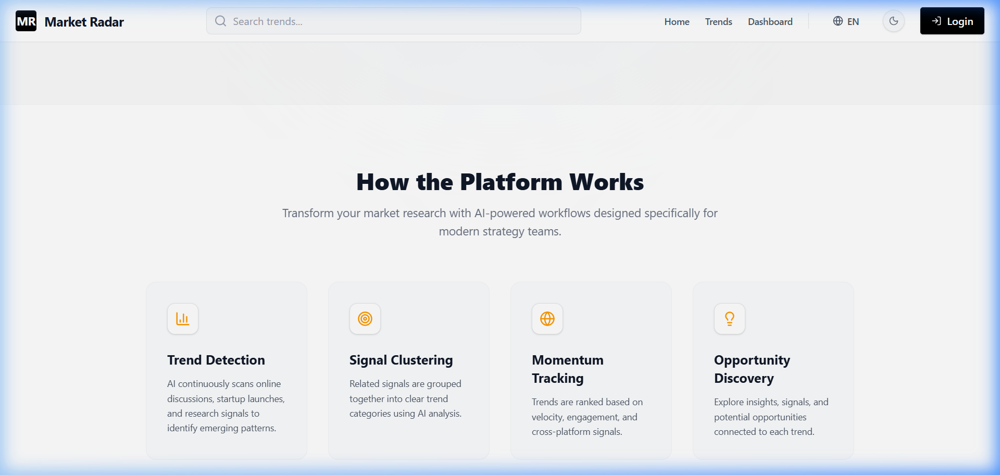
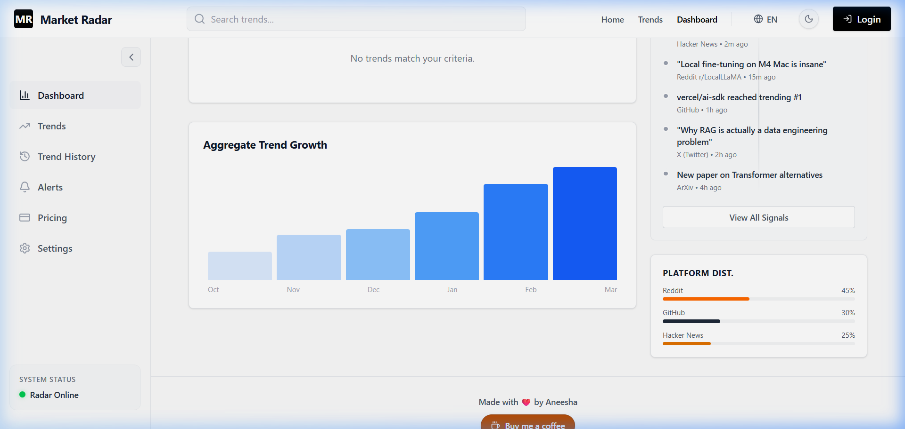
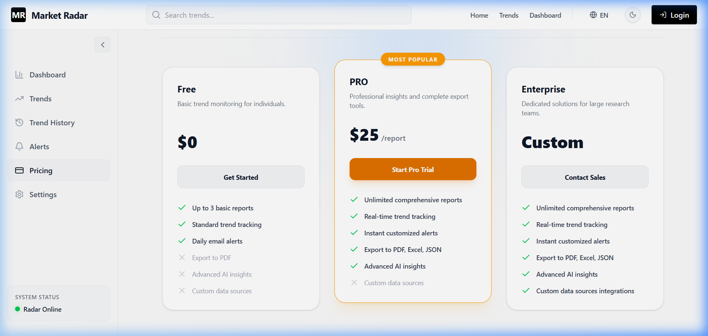
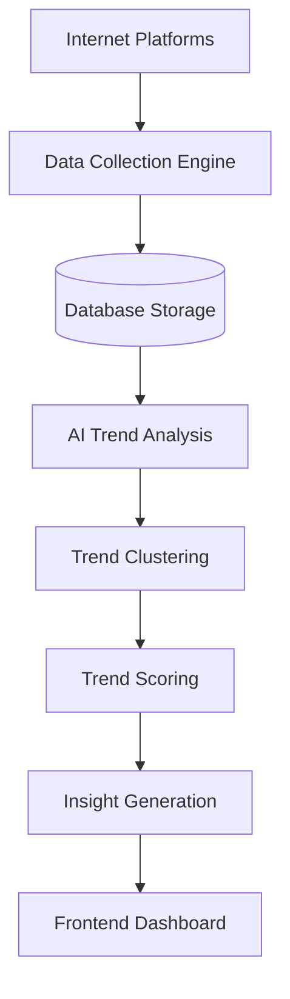

  <h1>📈 Market Radar</h1>
  
<b>Your AI-Powered Assistant for Discovering Early Market Signals</b>

  
  
  

 

## 🌟 Overview

**Market Radar** is a freemium web application that continuously scans internet platforms (like Reddit, GitHub, Hacker News), detects emerging technology and business trends using AI, and provides actionable insights. It helps founders, investors, creators, and researchers discover early signals of new opportunities before they become mainstream.

---

##  Live Demo & Screenshots

### [🌐 Visit the Live Website here!](https://trendy-tawny.vercel.app/)

 

### 📸 Application Previews

<table>
  <tr>
    <td align="center"><b>Homepage Preview</b></td>
    <td align="center"><b>Interactive Dashboard</b></td>
  </tr>
  <tr>
    <td></td>
    <td></td>
  </tr>
  <tr>
    <td align="center" colspan="2"><b>Flexible Pricing Plans</b></td>
  </tr>
  <tr>
    <td colspan="2" align="center"></td>
  </tr>
</table>

---

##  Target Audience

- **Startup Founders & Indie Hackers:** Find your next profitable idea.
- **Investors:** Spot early signals of emerging markets.
- **Content Creators & PMs:** Stay ahead of the curve.
- **Market Researchers:** Automate exhaustive platform scanning.

---

## ✨ Key Features

1. **Multi-Platform Data Collection:** Aggregates data from Reddit, GitHub, Product Hunt, Hacker News, and Google Trends.
2. **AI-Driven Trend Analysis:** Uses LLMs to cluster similar discussions and extract overarching themes from raw posts.
3. **Advanced Trend Scoring:** Measures mention velocity, engagement, and cross-platform growth.
4. **Insight Generation:** Translates complex data into human-readable AI explanations detailing *why* the trend is happening.

---

## ⚙️ Technical Stack

- **Frontend:** React, TailwindCSS, Recharts
- **Backend:** Node.js, Express.js
- **Database:** PostgreSQL (with optional Redis for caching)
- **AI Integration:** OpenAI API (or compatible LLM provider)
- **Background Jobs:** Node Cron, Bull Queue
- **Deployment:** Vercel (Frontend) & AWS/Render/Railway (Backend)

---

## 🏗️ System Workflow

---

## 📄 License

This project is licensed under the **MIT License**. See the [LICENSE](LICENSE) file for details.

 

  <i>made with ❤️ by Aneesha</i>

